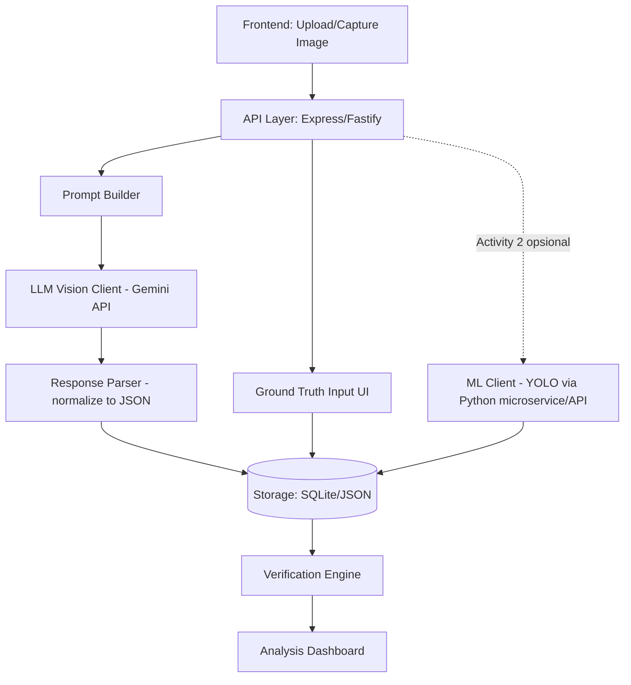

# System Design — Sistem Deteksi Objek Berbasis LLM (Vision) untuk Bangunan
**Pendamping dokumen:** PRD — Sistem Deteksi Objek LLM untuk Bangunan
**Stack:** Node.js / TypeScript

---

## 1. Architecture Overview

Sistem terdiri dari 5 komponen utama yang berjalan sebagai satu aplikasi web monolitik (cukup untuk skala class practical, tidak perlu microservices):



## 2. Komponen

### 2.1 Frontend (Web UI)
- Halaman upload gambar / akses kamera (`<input type="file" capture>` atau `getUserMedia`).
- Halaman input Ground Truth (checklist/daftar objek manual per gambar).
- Halaman hasil: tampilkan gambar + output LLM (dan ML jika Activity #2) berdampingan.
- Dashboard analisis: tabel rekap Correct/Missed/False/Misclassification per gambar & agregat.
- Framework ringan: React + Vite, atau cukup HTML/EJS + vanilla JS kalau ingin sesederhana mungkin untuk demo kelas.

### 2.2 API Layer
- Node.js + Express (atau Fastify) + TypeScript.
- Endpoint utama: terima gambar, jalankan prompt builder, panggil Gemini API, simpan hasil.

### 2.3 Prompt Builder
- Modul yang menyusun prompt final berdasarkan opsi yang dipilih user (deteksi dasar / + kondisi / + material / + pencahayaan).
- Prompt selalu meminta output **terstruktur (JSON)** supaya gampang diparse & dibandingkan dengan ground truth.

Contoh template:
```
Analisis gambar interior bangunan ini. Kembalikan HANYA dalam format JSON:
{
  "objects": [
    {
      "name": "string",
      "condition": "string (baik/rusak/aus/dll)",
      "material": "string",
      "confidence_note": "string (opsional)"
    }
  ],
  "lighting_quality": "string (terang/redup/merata/tidak merata)"
}
Jangan tambahkan teks di luar JSON.
```

### 2.4 LLM Vision Client
- Wrapper untuk Gemini API (`@google/generative-ai` SDK atau REST call langsung).
- Tangani retry sederhana kalau response bukan JSON valid (misal minta ulang dengan instruksi lebih tegas).
- Konfigurasi model via `.env` (`GEMINI_API_KEY`, `GEMINI_MODEL=gemini-1.5-flash` / `gemini-2.0-flash`).

### 2.5 Response Parser
- Validasi & normalisasi JSON dari LLM (guard terhadap markdown code fence, teks tambahan, dll).
- Simpan hasil mentah (raw response) juga untuk keperluan debugging/analisis prompt.

### 2.6 Ground Truth Module
- UI sederhana untuk mencatat: objek apa saja yang benar-benar ada di gambar (idealnya diisi **sebelum** melihat hasil LLM, untuk menghindari bias).
- Disarankan mahasiswa arsitek yang mengisi/validasi field material & kondisi, karena mereka domain expert-nya.

### 2.7 Verification Engine
Logika pembanding ground truth vs output LLM:
- **Correct Detection** — nama objek match (bisa pakai fuzzy match / sinonim sederhana, karena LLM mungkin bilang "kursi kantor" vs ground truth "kursi").
- **Missed Detection** — ada di ground truth, tidak ada di output LLM.
- **False Detection** — ada di output LLM, tidak ada di ground truth.
- **Misclassification** — objek terdeteksi di lokasi yang sama tapi label/kategori beda dari ground truth.
- Output: tabel per gambar + rekap agregat (dipakai langsung untuk menjawab Analysis Questions #1–5).

### 2.8 Storage
Untuk skala tugas kelas, **SQLite (better-sqlite3)** atau bahkan **file JSON per sesi** sudah cukup — tidak perlu database server terpisah.

Tabel/struktur data minimal:
```
images        (id, filename, uploaded_at, quality_variant)
prompts       (id, label, template_text)
llm_results   (id, image_id, prompt_id, raw_response, parsed_json, created_at)
ground_truth  (id, image_id, object_name, condition, material)
verifications (id, image_id, llm_result_id, object_name, status)  -- status: correct|missed|false|misclassified
ml_results    (id, image_id, detections_json)  -- untuk Activity #2, opsional
```

### 2.9 ML Client (Activity #2, opsional)
- Karena YOLO berbasis Python, opsi termudah: jalankan sebagai microservice Python kecil (Flask/FastAPI) yang dipanggil dari backend Node.js via HTTP — daripada porting YOLO ke Node.
- Alternatif lebih ringan: pakai model deteksi objek berbasis JS (mis. `@tensorflow-models/coco-ssd`) kalau mau tetap 100% Node.js — akurasinya lebih terbatas tapi cukup untuk perbandingan konsep di Activity #2.

## 3. Sequence Flow

**Activity #1 (wajib):**
1. User upload/ambil gambar.
2. (Sebelum lihat hasil AI) User/mhs arsitek isi Ground Truth untuk gambar tsb.
3. Sistem kirim gambar + prompt terpilih ke Gemini API.
4. Sistem parse & simpan hasil.
5. Verification Engine bandingkan hasil vs ground truth → tampilkan status per objek.
6. User ulangi langkah 3 dengan variasi prompt/kualitas gambar sesuai kebutuhan analisis.
7. Dashboard agregat dipakai untuk menjawab 10 Analysis Questions.

**Activity #2 (opsional):**
1. Gambar yang sama dikirim juga ke ML Client (YOLO).
2. Simpan `ml_results`.
3. Tampilkan hasil ML vs LLM berdampingan di dashboard untuk perbandingan manual/presentasi.

## 4. Folder Structure (usulan)

```
project-root/
├─ src/
│  ├─ server.ts
│  ├─ routes/
│  │  ├─ detect.ts
│  │  ├─ groundtruth.ts
│  │  └─ analysis.ts
│  ├─ services/
│  │  ├─ geminiClient.ts
│  │  ├─ promptBuilder.ts
│  │  ├─ responseParser.ts
│  │  ├─ verificationEngine.ts
│  │  └─ mlClient.ts        (opsional, Activity #2)
│  ├─ db/
│  │  ├─ schema.sql
│  │  └─ index.ts
│  └─ types/
│     └─ index.ts
├─ public/                   (frontend statis atau build React)
├─ data/
│  └─ images/                (upload sementara)
├─ .env
├─ package.json
└─ tsconfig.json
```

## 5. Non-Functional Notes
- **Cost control:** batasi jumlah request ke free tier Gemini (cek rate limit di aistudio.google.com/docs/pricing sebelum eksperimen besar).
- **Reproducibility:** simpan raw response + prompt yang dipakai untuk tiap eksperimen, supaya hasil bisa ditelusuri ulang saat menulis laporan analisis.
- **Deployment:** cukup dijalankan lokal (`npm run dev`) untuk keperluan demo & presentasi kelas — tidak perlu deploy ke cloud kecuali ingin didemokan online.

## 6. Yang Masih Perlu Diputuskan Tim
- Apakah Verification Engine dibuat otomatis (fuzzy matching nama objek) atau manual (tim isi status satu-satu di UI)? Manual lebih akurat untuk tugas kelas kecil, otomatis lebih cepat kalau data banyak.
- Apakah Activity #2 (ML client) benar-benar dikerjakan, atau cukup dijelaskan secara konseptual di presentasi kalau waktu terbatas.
